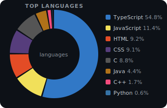

# Michael Njuki

Frontend Lead. Builder. Writer.

I craft interfaces that feel inevitable, the kind where users don't notice the design because it just *works*. UI/UX and design systems are my home base, but I move across the stack when the problem demands it.

When I'm not writing code I'm writing words. I break down ideas at the intersection of tech, attention, and ambition... no fluff, no filler. Catch it on the [blog](https://blog.mikenjuki.com).

Currently shipping multiple products. Always thinking about the next one.

---

### 🛠️ Stack

**Frontend**

**Backend & Systems**

---

### 🚧 What I'm Building

| Project | Description | Status |
|---|---|---|
| **LocalWiki** | Local-first team knowledge base with zero-knowledge encryption. Your wiki, your data. | Active |

---

### 📊 Languages

---

### 📎 Links

